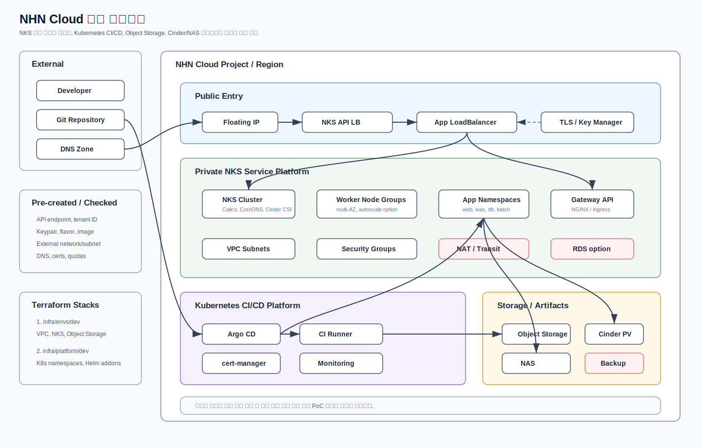

# NHN Cloud Terraform PoC

NHN Cloud에서 Terraform으로 생성/관리할 수 있는 리소스 범위를 분석하고, 공공기관 IaaS 3-tier 전환안과 클라우드 네이티브 전환안의 표준 아키텍처와 Terraform 프로젝트 골격을 정리한 저장소입니다.

기준 provider:

- `nhn-cloud/nhncloud` `v1.0.8`
- Terraform Registry schema 검증 기준 Resources `110개`, Data sources `53개`

## 구성

```text
docs/
  nhn-cloud-terraform-scope.md              # 구축 가능 범위와 표준 아키텍처
  nhn-cloud-terraform-provider-inventory.md # provider 전체 리소스/데이터소스 목록
  nhn-cloud-terraform-build-guide.md        # 구축 가이드 진입점
  nhn-cloud-public-iaas-3tier-build-guide.md
  nhn-cloud-cloud-native-build-guide.md
  assets/
    nhn-cloud-standard-architecture.svg     # 표준 아키텍처 비교도
    nhn-cloud-public-iaas-3tier-architecture.svg
    nhn-cloud-cloud-native-architecture.svg
infra/
  envs/dev/                                 # NHN Cloud foundation stack
  platform/dev/                             # NKS 내부 Kubernetes platform stack
  modules/                                  # 재사용 Terraform modules
harness/
  scripts/                                  # 검증/인벤토리 추출 스크립트
```

## 먼저 읽을 문서

1. [구축 범위와 표준 아키텍처](./docs/nhn-cloud-terraform-scope.md)
2. [NHN Cloud Terraform 구축 가이드](./docs/nhn-cloud-terraform-build-guide.md)
3. [공공기관 IaaS 3-tier 구축 가이드](./docs/nhn-cloud-public-iaas-3tier-build-guide.md)
4. [클라우드 네이티브 구축 가이드](./docs/nhn-cloud-cloud-native-build-guide.md)
5. [Provider Inventory](./docs/nhn-cloud-terraform-provider-inventory.md)

## 표준 아키텍처



설계는 두 가지 표준안으로 나뉩니다.

| 표준안 | 주요 구조 | Terraform 역할 |
|---|---|---|
| 공공기관 IaaS 3-tier 전환 | Web/WAS/DB VM, 운영 솔루션 서버, LB, volume | VPC, subnet, security group, compute, LB, volume, Object Storage 표준화 |
| 클라우드 네이티브 전환 | NKS, GitOps, CI/CD, Object Storage | VPC, NKS, Object Storage, namespace, StorageClass, Helm add-on 표준화 |

현재 구현된 Terraform 코드는 클라우드 네이티브 전환안의 foundation/platform 골격이다. IaaS 3-tier 전환안은 provider 지원 범위와 설계 기준을 문서화했으며, 실제 코드 적용 시 compute, load balancer, block storage 모듈 확장이 필요하다.

## 콘솔에서 먼저 확인할 값

Terraform 실행 전에 아래 값이 필요합니다.

| 값 | 용도 |
|---|---|
| NHN Cloud API Endpoint, Tenant ID, API Password | provider 인증 |
| Keypair name | NKS worker SSH 접근 |
| NKS worker flavor UUID | worker node 사양 |
| NKS node image UUID | worker base image |
| Kubernetes/addon version | NKS 생성 label |
| External network/subnet ID | NKS public endpoint |
| Internet Gateway ID | routing table attach |
| Quota | NKS, LB, volume 생성 가능성 확인 |

자세한 목록은 [구축 가이드](./docs/nhn-cloud-terraform-build-guide.md)의 공통 사전 준비와 전환 유형별 가이드를 참고하세요.

## 실행 순서

현재 코드 기준 실행 순서는 클라우드 네이티브 전환안에 해당합니다.

Cloud foundation:

```bash
cp ./infra/envs/dev/terraform.tfvars.example ./infra/envs/dev/terraform.tfvars

terraform -chdir=infra/envs/dev init -backend=false
terraform -chdir=infra/envs/dev plan
```

NKS 생성 후 Kubernetes platform:

```bash
cp ./infra/platform/dev/terraform.tfvars.example ./infra/platform/dev/terraform.tfvars

terraform -chdir=infra/platform/dev init
terraform -chdir=infra/platform/dev plan
```

`apply`는 plan을 검토한 뒤 실행합니다.

## 검증

Provider schema 검증:

```bash
pwsh ./harness/scripts/verify-registry-schema.ps1 -ProviderVersion 1.0.8
```

정적 검증:

```bash
pwsh ./harness/scripts/static-check.ps1 -TerraformRoot ./infra/envs/dev
```

Plan JSON 생성:

```bash
pwsh ./harness/scripts/plan-json.ps1 -TerraformRoot ./infra/envs/dev
```

## 운영 주의사항

- `terraform.tfvars`, state, plan 파일은 커밋하지 않습니다.
- 운영 `apply` 전에는 반드시 plan을 검토합니다.
- NKS cluster label, addon, node image, subnet, keypair 변경은 재생성 위험이 있습니다.
- Kubernetes Secret, CI token, registry password 같은 민감값은 Terraform state에 남기지 않습니다.
- provider code에는 있지만 문서화가 약한 리소스는 dev smoke 검증 후 운영 편입합니다.
