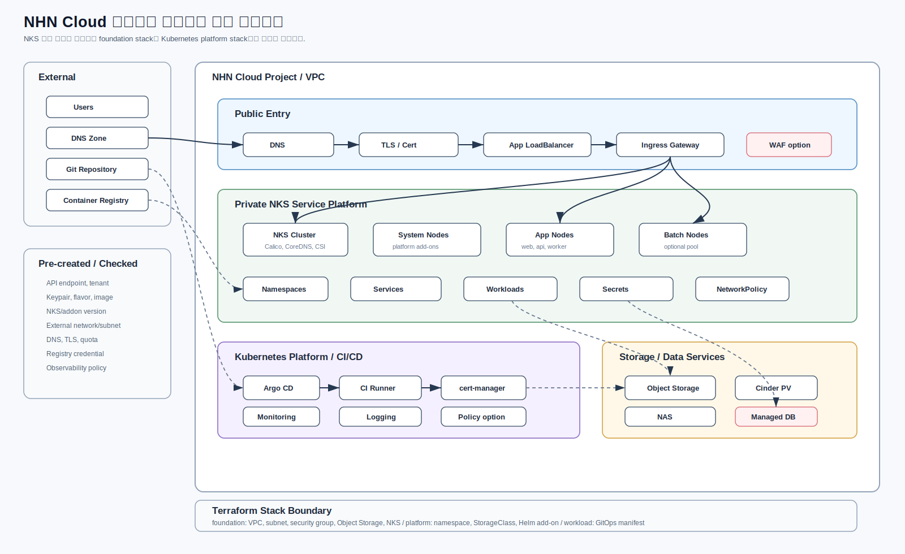

# NHN Cloud 클라우드 네이티브 구축 가이드

기준 provider: `nhn-cloud/nhncloud` `= 1.0.8`  
대상: NKS, GitOps, CI/CD, Object Storage 기반 컨테이너 플랫폼

아키텍처:



## 1. 적용 범위

이 가이드는 애플리케이션을 컨테이너로 전환하거나 신규 서비스를 NKS 기반으로 구축할 때 사용한다. NHN Cloud 리소스와 Kubernetes 내부 리소스의 생명주기를 분리하고, GitOps와 CI/CD를 표준 배포 경로로 둔다.

현재 저장소에는 기본 골격이 구현되어 있다.

| Stack | 경로 | 역할 |
|---|---|---|
| Cloud foundation | `infra/envs/dev` | VPC, subnet, routing table, security group, Object Storage, NKS |
| Kubernetes platform | `infra/platform/dev` | namespace, StorageClass, cert-manager, Argo CD, CI/CD 확장 add-on |

## 2. 콘솔 선행 확인 값

| 항목 | 필수 | 사용 위치 |
|---|---:|---|
| Tenant/Project ID, API Endpoint, API Password | 예 | provider 인증 |
| Region | 예 | provider 설정 |
| Internet Gateway ID | 조건부 | routing table attach |
| NKS worker flavor UUID | 예 | `nks_node_flavor_id` |
| NKS worker image UUID | 예 | `nks_node_image_id` |
| Keypair name | 예 | `nks_keypair_name` |
| Kubernetes version | 예 | `nks_kubernetes_version` |
| Calico/CoreDNS version | 예 | `nks_calico_version`, `nks_coredns_version` |
| External network/subnet ID | 예 | NKS public endpoint |
| DNS/TLS | 조건부 | Ingress/Gateway |
| Container Registry | 조건부 | CI/CD image push |
| Managed DB 또는 외부 DB | 조건부 | 애플리케이션 데이터 계층 |
| Quota | 예 | NKS worker, LB, volume, Floating IP 생성 가능성 |

## 3. Terraform 생성/관리 범위

`infra/envs/dev`에서 생성한다.

| 영역 | 리소스 |
|---|---|
| Network | `nhncloud_networking_vpc_v2`, `nhncloud_networking_routingtable_v2`, `nhncloud_networking_vpcsubnet_v2` |
| Gateway attachment | `nhncloud_networking_routingtable_attach_gateway_v2` |
| Security | `nhncloud_networking_secgroup_v2`, `nhncloud_networking_secgroup_rule_v2` |
| Object Storage | `nhncloud_objectstorage_container_v1` |
| NKS | `nhncloud_kubernetes_cluster_v1`, `nhncloud_kubernetes_nodegroup_v1` |

`infra/platform/dev`에서 생성한다.

| 영역 | 리소스 |
|---|---|
| Kubernetes namespace | `kubernetes_namespace_v1` |
| Kubernetes StorageClass | `kubernetes_storage_class_v1` |
| Helm add-on | `helm_release` |

기본 Helm add-on:

- `cert-manager`
- `argo-cd`

CI runner, Ingress controller, monitoring, logging, External Secrets, policy controller 등은 `extra_helm_releases`로 확장한다. runner token, registry password, webhook secret 같은 값은 Terraform state에 남을 수 있으므로 직접 변수로 넣지 않는다.

## 4. Cloud foundation 실행

`terraform.tfvars` 예시 파일을 복사한다.

```bash
cp ./infra/envs/dev/terraform.tfvars.example ./infra/envs/dev/terraform.tfvars
```

민감값은 환경 변수로 주입한다.

```bash
export TF_VAR_nhncloud_user_name="<NHN Cloud ID>"
export TF_VAR_nhncloud_tenant_id="<tenant-id>"
export TF_VAR_nhncloud_password="<api-password>"
export TF_VAR_nhncloud_auth_url="https://api-identity-infrastructure.nhncloudservice.com/v2.0"
export TF_VAR_nhncloud_region="KR1"
```

초기화와 검증:

```bash
terraform -chdir=infra/envs/dev init -backend=false
terraform -chdir=infra/envs/dev fmt -recursive
terraform -chdir=infra/envs/dev validate
terraform -chdir=infra/envs/dev plan -out=tfplan
terraform -chdir=infra/envs/dev show -json tfplan > ../../../harness/out/dev-foundation-plan.json
```

적용은 plan 검토와 승인 후 실행한다.

```bash
terraform -chdir=infra/envs/dev apply tfplan
```

적용 전 확인:

- VPC CIDR이 기존 네트워크, VPN, 전용회선 대역과 겹치지 않는지 확인
- `internet_gateway_id`가 해당 프로젝트/리전에 존재하는지 확인
- `nks_subnet_key`가 실제 생성되는 subnet key와 일치하는지 확인
- NKS version/addon version이 리전에서 지원되는지 확인
- Object Storage container 이름이 충돌하지 않는지 확인

## 5. Kubernetes platform 실행

NKS 생성 후 NHN Cloud 콘솔에서 kubeconfig를 발급받는다.

```bash
cp ./infra/platform/dev/terraform.tfvars.example ./infra/platform/dev/terraform.tfvars
```

`kubeconfig_path`, `kubeconfig_context`를 실제 값으로 수정한다.

초기화와 계획 확인:

```bash
terraform -chdir=infra/platform/dev init
terraform -chdir=infra/platform/dev fmt -recursive
terraform -chdir=infra/platform/dev validate
terraform -chdir=infra/platform/dev plan -out=tfplan
```

적용은 plan 검토와 승인 후 실행한다.

```bash
terraform -chdir=infra/platform/dev apply tfplan
```

기본 생성:

- `argocd` namespace
- `cert-manager` namespace
- `cicd` namespace
- `apps` namespace
- `observability` namespace
- `ingress-system` namespace
- `nhn-cinder-hdd-retain` StorageClass
- `cert-manager` Helm release
- `argocd` Helm release

## 6. CI/CD 설계 기준

권장 흐름:

```text
Developer -> Git Repository -> CI Runner -> Container Registry -> Argo CD -> NKS Workloads
```

| 구성요소 | 역할 | Terraform 관리 방식 |
|---|---|---|
| Git repository | 소스와 manifest 저장 | Terraform 범위 밖 |
| CI Runner | build/test/image push | Helm release 가능. token은 별도 Secret |
| Container Registry | 이미지 저장 | 콘솔/서비스 API 또는 외부 registry |
| Argo CD | GitOps CD | `k8s-platform` module |
| cert-manager | 인증서 자동화 | `k8s-platform` module |
| Ingress/Gateway | 외부 트래픽 진입 | Helm release 또는 별도 manifest |
| Object Storage | artifact, backup, export 저장 | `object-storage` module |

민감값 처리:

- GitLab Runner registration token, GitHub token, registry password는 Terraform 변수에 직접 넣지 않는다.
- 필요한 경우 Kubernetes Secret을 수동 생성하거나 External Secrets/Sealed Secrets를 사용한다.
- Terraform으로 Secret을 만들면 state에 평문 또는 base64 값이 남을 수 있다.

## 7. Object Storage 사용 기준

기본 container:

| Container | 용도 |
|---|---|
| `artifacts` | CI build artifact, release bundle |
| `backups` | DB dump, manifest export, 장애 복구 자료 |
| `logs` | pipeline log, 배치 처리 결과 |

주의:

- Terraform으로 대량 object를 직접 관리하지 않는다.
- Object Storage를 Terraform backend로 쓰려면 backend bucket/container를 먼저 만들어야 한다.
- NHN Object Storage S3 호환 backend는 별도 smoke 검증 후 운영 적용한다.

## 8. 검증 항목

| 검증 | 기준 |
|---|---|
| NKS API | kubeconfig로 cluster 접근 가능 |
| Node group | node 상태 Ready, worker flavor/image/version 확인 |
| StorageClass | PVC 생성과 PV binding 확인 |
| cert-manager | controller pod 정상, issuer 전략 확정 |
| Argo CD | server/controller/repo-server 정상 |
| Ingress/Gateway | 외부 LB와 라우팅 정상 |
| CI/CD | runner 등록, image build/push, GitOps sync 확인 |
| Object Storage | artifact/log/backup container CRUD smoke 확인 |
| Observability | metrics/log 수집과 alerting 경로 확인 |

## 9. 완료 기준

- `infra/envs/dev` plan 리뷰 완료
- NKS 생성 후 kubeconfig 발급 확인
- `infra/platform/dev` plan 리뷰 완료
- Argo CD/cert-manager 설치 상태 확인
- StorageClass/PVC 동작 smoke 확인
- Object Storage container CRUD smoke 확인
- CI runner와 registry 연동 방식 확정
- DNS/TLS와 Ingress/Gateway 노출 방식 확정
- 문서에 콘솔 선행 값과 실제 적용 값 기록

## 10. 운영 주의사항

- 운영 `terraform destroy`는 금지한다.
- NKS cluster label, addon, node image, subnet, keypair 변경은 재생성 위험을 검토한다.
- runner token, registry password, kubeconfig는 Terraform state에 남기지 않는다.
- workload manifest는 GitOps 저장소에서 관리하고 Terraform은 platform 경계까지만 담당한다.
- Managed DB 또는 stateful workload는 별도 PoC 후 운영 편입한다.
