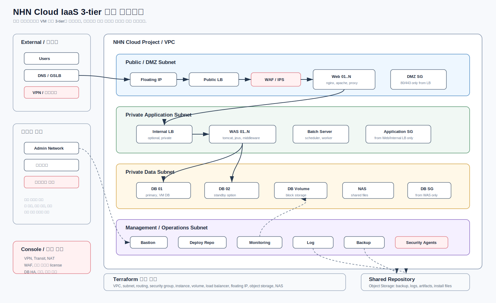

# NHN Cloud Terraform 구축 범위와 표준 아키텍처

조사 기준일: 2026-05-12  
기준 provider: `nhn-cloud/nhncloud` `v1.0.8`  
검증 기준: Terraform Registry, NHN Cloud 사용자 가이드, provider GitHub 저장소의 `v1.0.8` 태그 `14725d0` / `nhncloud/provider.go`

## 결론

`nhn-cloud/nhncloud` provider는 `v1.0.8` 기준 `ResourcesMap` 110개, `DataSourcesMap` 53개를 노출한다. Terraform Registry에서 내려받은 provider schema와 이름 목록까지 대조했고 차이는 없다. 다만 NHN Cloud 사용자 가이드와 provider 문서에 명확히 설명된 운영 안전 범위는 그보다 좁다.

따라서 구축 전략은 다음처럼 나눈다.

| 등급 | 의미 | 적용 |
|---|---|---|
| A | NHN Cloud 문서 또는 provider docs에 명확히 있는 리소스 | 표준 Terraform 모듈 우선 대상 |
| B | provider 코드에는 있지만 NHN Cloud 문서화가 약한 리소스 | dev smoke 검증 후 제한 적용 |
| C | provider에도 없거나 NHN Cloud API/콘솔만 확인된 서비스 | Terraform 표준 범위 밖. 콘솔/API/별도 자동화 |

전체 리소스 목록은 [provider inventory](./nhn-cloud-terraform-provider-inventory.md)에 분리했다. 실제 구축 절차는 [NHN Cloud Terraform 구축 가이드](./nhn-cloud-terraform-build-guide.md)를 진입점으로 삼고, [IaaS 3-tier 구축 가이드](./nhn-cloud-iaas-3tier-build-guide.md)와 [클라우드 네이티브 구축 가이드](./nhn-cloud-cloud-native-build-guide.md)를 각각 따른다.

## 표준 아키텍처


### IaaS 3-tier 전환



이 구조는 기존 업무시스템을 Web/WAS/DB VM 계층으로 이전하는 전환 사업에 맞춘다. DMZ, Application, Data, Management/Operations subnet을 분리하고 모니터링, 로그, 백업, 보안 솔루션 서버를 운영망에 배치한다.

주요 Terraform 범위:

- VPC, subnet, routing table, security group
- Floating IP, public/internal load balancer
- Web/WAS/DB/운영 솔루션용 compute instance
- DB/log/backup volume과 volume attachment
- Object Storage, NAS

Terraform 밖 또는 선행 확정 범위:

- VPN, 전용회선, Transit Hub, NAT Gateway
- WAF, 보안관제, 백신/EDR, 취약점 점검 솔루션 라이선스와 설치 절차
- DB HA, 백업, 감사, 접근통제 정책

### 클라우드 네이티브 전환


이 구조는 NKS 기반 서비스 플랫폼, GitOps, CI/CD, Object Storage를 중심으로 애플리케이션을 컨테이너화하는 전환 사업에 맞춘다. NHN Cloud foundation stack과 Kubernetes platform stack을 분리한다.

주요 Terraform 범위:

- VPC, subnet, routing table, security group
- Object Storage, NKS cluster, NKS nodegroup
- Kubernetes namespace, StorageClass
- Argo CD, cert-manager, CI runner, ingress, monitoring/logging Helm add-on

Terraform 밖 또는 선행 확정 범위:

- Container Registry, DNS/TLS, registry credential
- Managed DB 또는 외부 DB 연동 방식
- 운영 관제 연동, secret 관리 방식
- workload manifest와 애플리케이션 배포 정책

구성 원칙:

- IaaS 전환은 VM, LB, volume, 운영 솔루션 서버까지 포함해 기존 업무 구조를 안정적으로 이전하는 것을 우선한다.
- 클라우드 네이티브 전환은 NKS와 GitOps 플랫폼을 기준으로 애플리케이션 배포/운영 표준을 만든다.
- NHN Cloud 쪽은 VPC, Subnet, Routing Table, Security Group, Compute, Load Balancer, NKS, Object Storage, Block Storage, NAS, Key Manager를 우선 표준화한다.
- NKS 내부는 `Argo CD`, `cert-manager`, CI runner, Gateway/Ingress, StorageClass, observability add-on을 별도 Kubernetes platform stack으로 관리한다.
- NAT/VPN/Transit Hub/RDS처럼 문서화 또는 provider 실사용 검증이 부족한 영역은 분홍색 박스로 표시했고, 운영 적용 전 별도 smoke 검증 또는 콘솔 선행 리소스로 둔다.

## Terraform으로 생성/관리/삭제 가능한 우선 범위

아래 표는 운영 표준 모듈로 먼저 만들 범위다.

| 영역 | 가능한 작업 | 대표 리소스 | 판단 |
|---|---|---|---|
| VPC | VPC 생성/변경/삭제 | `nhncloud_networking_vpc_v2` | A |
| VPC Subnet | 서브넷 생성/변경/삭제 | `nhncloud_networking_vpcsubnet_v2` | A |
| Routing Table | 라우팅 테이블 생성/변경/삭제, 게이트웨이 연결 | `nhncloud_networking_routingtable_v2`, `nhncloud_networking_routingtable_attach_gateway_v2` | A |
| Security Group | 보안 그룹과 ingress/egress rule 생성/변경/삭제 | `nhncloud_networking_secgroup_v2`, `nhncloud_networking_secgroup_rule_v2` | A |
| Port | 네트워크 포트 생성/변경/삭제 | `nhncloud_networking_port_v2` | A |
| Floating IP | 공인 IP 생성/연결/해제/삭제 | `nhncloud_networking_floatingip_v2`, `nhncloud_networking_floatingip_associate_v2` | A |
| Compute | 인스턴스 생성/변경/삭제 | `nhncloud_compute_instance_v2` | A |
| Key Pair | 키페어 생성/등록/삭제 | `nhncloud_compute_keypair_v2` | A |
| Volume Attach | 인스턴스에 블록 스토리지 연결/해제 | `nhncloud_compute_volume_attach_v2` | A |
| Block Storage | 볼륨 생성/변경/삭제, 스냅샷 기반 생성 | `nhncloud_blockstorage_volume_v2` | A |
| Load Balancer | LB, listener, pool, member, health monitor 생성/변경/삭제 | `nhncloud_lb_loadbalancer_v2`, `nhncloud_lb_listener_v2`, `nhncloud_lb_pool_v2`, `nhncloud_lb_member_v2`, `nhncloud_lb_monitor_v2` | A |
| NKS | 클러스터/노드그룹 생성, resize, nodegroup upgrade | `nhncloud_kubernetes_cluster_v1`, `nhncloud_kubernetes_nodegroup_v1`, `nhncloud_kubernetes_cluster_resize_v1`, `nhncloud_kubernetes_nodegroup_upgrade_v1` | A |
| NAS | NAS 볼륨, 인터페이스, 복제 생성/변경/삭제 | `nhncloud_nas_storage_volume_v1`, `nhncloud_nas_storage_volume_interface_v1`, `nhncloud_nas_storage_volume_mirror_v1` | A |
| Key Manager | secret, container 생성/조회/삭제 | `nhncloud_keymanager_secret_v1`, `nhncloud_keymanager_container_v1` | A |
| Object Storage | container/object 생성/변경/삭제 | `nhncloud_objectstorage_container_v1`, `nhncloud_objectstorage_object_v1` | A- |

`Object Storage`는 NHN Cloud Terraform 가이드에 리소스명이 언급되고 provider 코드에도 등록되어 있다. 다만 현재 provider `docs/resources`에는 별도 md가 없으므로 첫 PoC에서 실제 CRUD smoke를 반드시 수행한다.

## Provider 코드상 추가 노출 범위

아래 영역은 provider 코드에 등록되어 있으므로 Terraform resource type 자체는 존재한다. 하지만 NHN Cloud 사용자 가이드에서 Terraform 표준 범위로 명확히 설명되지 않았거나, OpenStack provider 계열 리소스를 그대로 노출한 성격이 강해 dev 검증 전에는 운영 표준으로 보지 않는다.

| 영역 | 포함 예시 | 운영 판단 |
|---|---|---|
| Block Storage v3/QoS/Quota | `nhncloud_blockstorage_volume_v3`, `nhncloud_blockstorage_qos_v3`, `nhncloud_blockstorage_quotaset_v3` | B |
| Compute admin/확장 | `nhncloud_compute_flavor_v2`, `nhncloud_compute_aggregate_v2`, `nhncloud_compute_servergroup_v2`, `nhncloud_compute_quotaset_v2` | B |
| DB | `nhncloud_db_instance_v1`, `nhncloud_db_user_v1`, `nhncloud_db_configuration_v1`, `nhncloud_db_database_v1` | B |
| DNS | `nhncloud_dns_zone_v2`, `nhncloud_dns_recordset_v2` | B |
| FW/VPNaaS | `nhncloud_fw_*`, `nhncloud_vpnaas_*` | B |
| Identity | `nhncloud_identity_*` | B |
| Image 관리 | `nhncloud_images_image_v2`, image access 리소스 | B |
| LB 고급 | `nhncloud_lb_l7policy_v2`, `nhncloud_lb_l7rule_v2`, `nhncloud_lb_quota_v2`, v1 LB 리소스 | B |
| Neutron/OpenStack 네트워크 | router, subnetpool, QoS, trunk, RBAC, port forwarding 등 | B |
| Shared Filesystem(OpenStack Manila) | `nhncloud_sharedfilesystem_*` | B |
| Orchestration | `nhncloud_orchestration_stack_v1` | B |
| Object Storage tempurl | `nhncloud_objectstorage_tempurl_v1` | B |

정확한 resource/data source 이름은 [provider inventory](./nhn-cloud-terraform-provider-inventory.md)에 전부 기록했다.

## Terraform 표준 범위 밖

아래는 이번 표준 아키텍처에서 Terraform 1차 범위로 잡지 않는다.

| 영역 | 이유 | 처리 |
|---|---|---|
| 조직/프로젝트/IAM 거버넌스 | provider에는 일부 identity 리소스가 있으나 NHN Cloud 운영 권한 모델과 충돌 가능 | 콘솔/운영 절차 우선 |
| NAT Gateway, Transit Hub, Direct Connect, Peering/Colocation Gateway | 공식 Terraform 문서화 부족 | 콘솔 생성 후 ID 주입 또는 API 별도 검증 |
| NHN Cloud 관리형 Monitoring, CloudTrail, Resource Watcher | provider 리소스 확인 안 됨. 단, VM 기반 모니터링 서버 자체는 Compute로 생성 가능 | 콘솔/API/운영 도구 |
| Managed 서비스 전반 | 서비스별 API와 provider 지원 범위 차이 큼 | 별도 PoC 후 편입 |
| Public API 직접 호출 | Terraform state와 drift 관리 약함 | 마지막 수단 |

## 하네스 반영 방식

하네스는 문서 본문에만 적지 않고 파일로 분리했다.

| 파일 | 역할 |
|---|---|
| [AGENTS.md](../AGENTS.md) | 이 저장소에서 작업할 때 따라야 하는 provider/검증/승인 규칙 |
| [harness/README.md](../harness/README.md) | 하네스 실행 순서와 승인 기준 |
| [extract-provider-inventory.ps1](../harness/scripts/extract-provider-inventory.ps1) | provider 코드의 `ResourcesMap`, `DataSourcesMap` 추출 |
| [static-check.ps1](../harness/scripts/static-check.ps1) | `fmt`, `init -backend=false`, `validate`, `tflint`, `checkov/tfsec` 실행 |
| [plan-json.ps1](../harness/scripts/plan-json.ps1) | `terraform plan`과 plan JSON 생성 |

검증 gate:

1. provider inventory 확인
2. 정적 검증
3. plan JSON 생성
4. 공개 인바운드, destroy, 과도한 Floating IP, 운영 `-target` 사용 여부 확인
5. 사용자 승인 후 dev smoke 적용
6. 운영은 `refresh-only plan`으로 drift 감지

## 권장 모듈 구조

```text
infra/
  envs/
    iaas-3tier-dev/   # IaaS 3-tier foundation
    cloud-native-dev/ # NKS foundation
    stage/
    prod/
  platform/
    cloud-native-dev/ # Kubernetes platform addons after NKS kubeconfig is ready
  modules/
    network/
    security/
    compute/
    load-balancer/
    block-storage/
    nks/
    object-storage/
    k8s-platform/
harness/
docs/
```

운영 원칙:

- provider 버전은 `= 1.0.8`처럼 정확히 고정한다.
- 환경별 state는 반드시 분리한다.
- 콘솔 선행 리소스는 module 내부에서 만들지 말고 변수로 ID를 주입한다.
- `terraform apply`는 dev smoke 후 stage/prod로 승격한다.
- `*.tfvars`, state, plan JSON은 커밋하지 않는다.

## 다음 PoC 순서

1. `provider inventory`를 baseline으로 확정
2. 클라우드 네이티브 전환안은 기존 `network/security/object-storage/nks/k8s-platform` 모듈로 smoke stack 검증
3. IaaS 3-tier 전환안은 `compute/load-balancer/block-storage` 모듈을 추가한 뒤 Web/WAS/DB 최소 stack 검증
4. `harness/scripts/static-check.ps1` 실행
5. 사용자 승인 후 dev 환경에서 최소 리소스 apply
6. 실제 성공한 리소스만 운영 표준 등급 A로 승격

## 참고 출처

- NHN Cloud Terraform 사용 가이드: https://docs.nhncloud.com/ko/Compute/Instance/ko/terraform-guide/
- NHN Cloud NAS Terraform 사용 가이드: https://docs.nhncloud.com/ko/Storage/NAS/ko/terraform-guide/
- Terraform Registry `nhn-cloud/nhncloud`: https://registry.terraform.io/providers/nhn-cloud/nhncloud/latest/docs
- NHN Cloud provider GitHub: https://github.com/nhn-cloud/terraform-provider-nhncloud
- NHN Cloud Object Storage S3 호환 API: https://docs.nhncloud.com/ko/Storage/Object%20Storage/ko/s3-api-guide/
- NHN Cloud VPC OpenStack 호환 API: https://docs.nhncloud.com/ko/Network/VPC/ko/public-api-compat/
