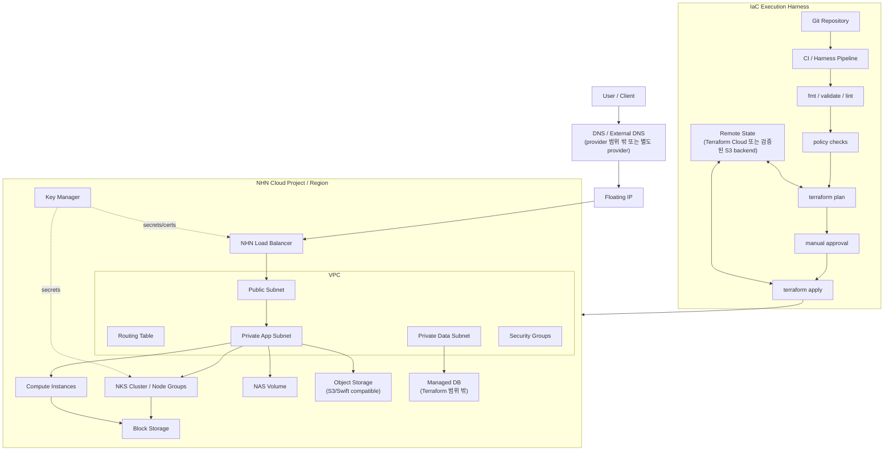

# NHN Cloud Terraform Provider 분석 및 구축 범위

조사 기준일: 2026-05-12  
대상: 일반 NHN Cloud 기준. 공공기관용 NHN Cloud는 `auth_url`, 리전, 서비스 제공 범위가 다를 수 있으므로 별도 검증이 필요합니다.

## 핵심 결론

- 주 provider는 `nhn-cloud/nhncloud`를 사용합니다. Terraform Registry 기준 최신 버전은 `1.0.8`이며, GitHub 릴리스도 `v1.0.8`이 최신으로 표시됩니다.
- Terraform으로 안정적으로 표준화할 수 있는 범위는 IaaS 중심입니다. Compute, VPC 일부, Load Balancer, Security Group, Floating IP, Block Storage, NAS, NKS, Key Manager 일부가 핵심 범위입니다.
- RDS, Monitoring, DNS Plus, NAT Gateway, Transit Hub, VPN, Direct Connect, IAM/조직/프로젝트, CloudTrail 등은 공식 provider 리소스로 확인되지 않았습니다. 이런 서비스는 콘솔/API/별도 자동화로 분리하는 편이 안전합니다.
- Object Storage는 공식 가이드에 Terraform 리소스가 언급되어 있으나, S3 호환 API도 함께 제공됩니다. PoC에서는 provider schema로 실제 지원 여부를 먼저 검증하고, 필요 시 `hashicorp/aws` provider를 S3 호환 모드로 제한 사용합니다.
- OpenStack provider는 NHN Cloud의 일부 OpenStack 호환 API에 붙일 수 있는 가능성은 있지만, NHN Cloud 문서가 필드와 메서드가 제한된다고 명시합니다. 표준 아키텍처의 기본 provider로 쓰지 않습니다.

## 사용할 수 있는 Terraform Provider

| 구분 | Provider | 사용 판단 | 주요 용도 | 주의 |
|---|---|---:|---|---|
| 기본 | `nhn-cloud/nhncloud` | 권장 | NHN Cloud 공식 Terraform 리소스 관리 | 버전을 고정하고 provider schema 검증 필요 |
| 보조 | `hashicorp/aws` | 제한 사용 | Object Storage S3 호환 API로 버킷/오브젝트 관리 | S3 외 AWS API 호출은 실패 가능. endpoint/검증 skip 설정 필요 |
| 보조 | `terraform-provider-openstack/openstack` | 제한 사용 | OpenStack 호환 Neutron/Swift 계열 실험 | NHN Cloud 호환 API는 메서드/필드가 제한됨 |
| 비권장 | `null`, `external`, local-exec API 호출 | 예외만 | provider 미지원 API 호출 | 상태 동기화, 재시도, 삭제 안정성이 낮음 |

## 공식 Provider 구축 가능 범위

| 영역 | Terraform으로 구축 가능 | 대표 리소스 | 비고 |
|---|---|---|---|
| Compute | 인스턴스, 키페어, 블록 스토리지 연결 | `nhncloud_compute_instance_v2`, `nhncloud_compute_keypair_v2`, `nhncloud_compute_volume_attach_v2` | Terraform으로 키페어 생성 시 private key가 state에 저장될 수 있어 외부 생성/등록 권장 |
| Image/Flavor 조회 | 이미지, 인스턴스 타입 조회 | `data.nhncloud_images_image_v2`, `data.nhncloud_compute_flavor_v2` | 이미지명은 변경될 수 있어 exact name과 `most_recent` 정책 필요 |
| Network | VPC, 서브넷, 포트, Floating IP, 라우팅 테이블, 보안 그룹 | `nhncloud_networking_vpc_v2`, `nhncloud_networking_vpcsubnet_v2`, `nhncloud_networking_port_v2`, `nhncloud_networking_floatingip_v2`, `nhncloud_networking_secgroup_v2` | 공식 가이드상 VPC 일부 리소스만 생성 지원 |
| Internet Gateway 연결 | 기존 Gateway를 라우팅 테이블에 연결 | `nhncloud_networking_routingtable_attach_gateway_v2` | Internet Gateway 자체 생성은 콘솔 선행으로 보는 것이 안전 |
| Load Balancer | LB, listener, pool, member, monitor | `nhncloud_lb_loadbalancer_v2`, `nhncloud_lb_listener_v2`, `nhncloud_lb_pool_v2`, `nhncloud_lb_member_v2`, `nhncloud_lb_monitor_v2` | `shared`/`dedicated` 타입 검증 필요 |
| Block Storage | 볼륨 생성, 스냅샷 기반 생성, 인스턴스 연결 | `nhncloud_blockstorage_volume_v2` | encryption 사용 시 SKM 정보 관리 필요 |
| Object Storage | 컨테이너/오브젝트 | `nhncloud_objectstorage_container_v1`, `nhncloud_objectstorage_object_v1` | 최신 provider schema에서 반드시 재확인 |
| NAS | NAS 볼륨, 인터페이스, 복제 | `nhncloud_nas_storage_volume_v1`, `nhncloud_nas_storage_volume_interface_v1`, `nhncloud_nas_storage_volume_mirror_v1` | CIFS 인증 정보, 암호화 키 저장소는 선행 준비 필요 |
| Container/NKS | NKS 클러스터, 노드 그룹, resize/upgrade | `nhncloud_kubernetes_cluster_v1`, `nhncloud_kubernetes_nodegroup_v1`, `nhncloud_kubernetes_cluster_resize_v1`, `nhncloud_kubernetes_nodegroup_upgrade_v1` | Kubernetes/addon 버전은 리전별 지원값 검증 필요 |
| Key Manager | secret, secret container | `nhncloud_keymanager_secret_v1`, `nhncloud_keymanager_container_v1` | 민감값 state 저장 정책 필요 |

## Terraform 범위 밖으로 둘 항목

| 영역 | 제외 사유 | 처리 방식 |
|---|---|---|
| IAM, 조직, 프로젝트, 계정 거버넌스 | 공식 provider 리소스 확인 안 됨 | 콘솔/운영 절차/별도 API 자동화 |
| RDS for MySQL/PostgreSQL/MariaDB/MS-SQL, EasyCache | 공식 provider 리소스 확인 안 됨 | 콘솔 또는 서비스 API 기반 별도 프로비저닝 |
| DNS Plus, Private DNS | 공식 provider 리소스 확인 안 됨 | 콘솔/API. 외부 DNS provider 사용 가능 |
| NAT Gateway, Transit Hub, VPN, Direct Connect, Peering/Colocation Gateway, Service Gateway | 공식 provider 리소스 확인 안 됨 | 콘솔 생성 후 ID를 Terraform 변수로 주입 |
| Flow Log, Network ACL, Traffic Mirroring | 공식 provider 리소스 확인 안 됨 | 콘솔/API |
| Monitoring, CloudTrail, Resource Watcher | 공식 provider 리소스 확인 안 됨 | 운영 도구/콘솔/API |
| AI, Search, Game, Mobile, Collaboration 계열 | IaaS provider 범위 밖 | 서비스별 SDK/API |

## 표준 아키텍처



## 권장 Terraform 구성

```text
infra/
  envs/
    dev/
    stage/
    prod/
  modules/
    network/
    security/
    load-balancer/
    compute/
    nks/
    block-storage/
    nas/
    object-storage/
  harness/
    policies/
    smoke/
docs/
  nhn-cloud-terraform-scope.md
```

원칙:

- root module은 환경별로 분리합니다. `envs/dev`, `envs/prod`가 서로 다른 state를 가져야 합니다.
- 공통 구성은 module로 분리하되, 초기 PoC에서는 `network`, `security`, `compute/nks`, `storage` 정도만 만듭니다.
- 콘솔 선행 리소스는 `variables.tf`에 ID로 주입합니다. 예: Internet Gateway, NAT Gateway, Managed DB, CIFS 인증 정보, SKM key store.
- 모든 provider 버전은 고정합니다. 예: `~> 1.0.8`이 아니라 PoC 중에는 `= 1.0.8` 권장.
- 민감값은 `*.tfvars`에 평문 저장하지 않고 `TF_VAR_*` 또는 CI secret로 주입합니다.

## 하네스 엔지니어링 반영안

여기서 하네스는 특정 SaaS 제품이 아니라, Terraform 작업을 반복 가능하게 검증하는 실행/검증 체계를 의미합니다.

### 1. Provider Capability Harness

목적: 문서와 실제 provider schema 차이를 줄입니다.

```bash
terraform init -backend=false
terraform providers schema -json > harness/provider-schema/nhncloud-1.0.8.json
```

이 JSON에서 `resource_schemas`와 `data_source_schemas`를 추출해 지원 리소스 표를 자동 생성합니다. Object Storage처럼 문서와 provider docs가 어긋날 수 있는 영역은 이 단계에서 확정합니다.

### 2. Static Validation Harness

최소 검증 순서:

```bash
terraform fmt -check -recursive
terraform init -backend=false
terraform validate
tflint --init
tflint --recursive
```

보안 검사는 선택이 아니라 기본 gate로 둡니다.

```bash
checkov -d infra
# 또는
tfsec infra
```

### 3. Plan Harness

`apply` 전에 항상 저장된 plan을 만듭니다.

```bash
terraform plan -out=tfplan
terraform show -json tfplan > tfplan.json
```

`tfplan.json`에는 다음 정책을 적용합니다.

- `0.0.0.0/0` 인바운드는 80/443 외 금지
- SSH/RDP는 지정된 관리 CIDR만 허용
- `delete_on_termination = false` 볼륨은 명시적 태그/이름 규칙 요구
- Floating IP 생성 수 제한
- `destroy` 액션은 수동 승인 필수
- 운영 환경은 `-target` 사용 금지

### 4. Smoke Harness

비용과 위험이 낮은 순서로 검증합니다.

1. `network-smoke`: VPC, subnet, security group만 생성/삭제
2. `compute-smoke`: 최소 사양 인스턴스 1대, 볼륨 1개, SG 연결
3. `lb-smoke`: shared LB, listener, pool, member 연결
4. `nks-smoke`: 최소 노드 그룹 클러스터. 비용이 크므로 별도 승인 필요
5. `nas-smoke`: 최소 300GB 요구로 비용 영향이 있어 별도 승인 필요

### 5. Drift Harness

운영은 주기적으로 read-only plan을 실행합니다.

```bash
terraform plan -refresh-only
```

결과는 Slack/메일로 알리고, 자동 apply는 하지 않습니다. drift가 있으면 콘솔 변경인지 Terraform 누락인지 먼저 판정합니다.

### 6. Import Harness

기존 NHN Cloud 리소스가 있으면 바로 재생성하지 말고 import부터 합니다.

```bash
terraform import nhncloud_blockstorage_volume_v2.example <block_storage_id>
terraform import nhncloud_networking_secgroup_v2.example <security_group_id>
```

import 후 `terraform plan`이 no-op에 가깝게 나오도록 속성을 맞춘 뒤 모듈화합니다.

## PoC 진행 순서

1. provider `1.0.8`로 schema 추출
2. 지원 리소스 표 자동 생성
3. `network`와 `security` 모듈 작성
4. `compute` 또는 `nks` 중 하나만 선택해 smoke stack 작성
5. `fmt/validate/tflint/checkov/plan` 하네스 적용
6. 콘솔 선행 리소스 목록 확정
7. 운영 표준 아키텍처를 dev/stage/prod로 확장

## 참고 출처

- NHN Cloud Terraform 사용 가이드: https://docs.nhncloud.com/ko/Compute/Instance/ko/terraform-guide/
- NHN Cloud Terraform Registry: https://registry.terraform.io/providers/nhn-cloud/nhncloud/latest/docs
- NHN Cloud Terraform provider GitHub: https://github.com/nhn-cloud/terraform-provider-nhncloud
- NHN Cloud NAS Terraform 사용 가이드: https://docs.nhncloud.com/ko/Storage/NAS/ko/terraform-guide/
- NHN Cloud Object Storage S3 호환 API 가이드: https://docs.nhncloud.com/ko/Storage/Object%20Storage/ko/s3-api-guide/
- NHN Cloud VPC OpenStack 호환 API 가이드: https://docs.nhncloud.com/ko/Network/VPC/ko/public-api-compat/
